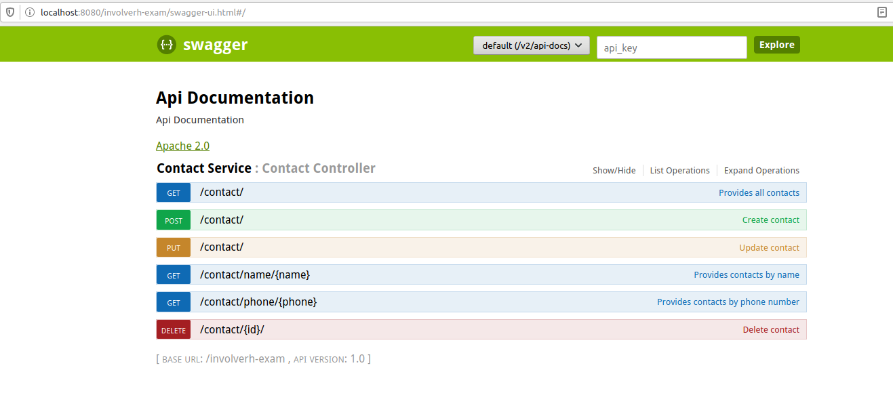

# contact-api-exam
## API Spring Boot 


Esta API porporciona la consulta, alta, actualizacion y eliminacion de un contacto telefonico

### Tecnologías

* Spring Boot 2.4.2
* Gradle 7.5.1
* Swagger 2:2.5.0

### Compilación y Despliegue

Para la compilación se implemento gradle, ejecutar la siguiente instrucción:

```
./gradlew clean build
```

Para la compilación se implemento gradle, ejecutar la siguiente instrucción:

```
./gradlew bootRun
```

### Ejecutando las pruebas unitarias

Para correr las pruebas unitarias, ejecutar el siguiente comando:

```
./gradlew test
```
Al finalizar gradle genera archivos de resultados de prueba HTML: directorio **/build/reports/tests/**

### Swagger

Se implementó swagger para la documentación de la API, para acceder a  Swagger UI

```
http://localhost:8080/involverh-exam/swagger-ui.html#
```


### Acerca de los servicios

Se exponen seis servicios en la API:

**URL de acceso**

```
Método GET  http://localhost:8080/involverh-exam/contact
```

```
Método GET  http://localhost:8080/involverh-exam/contact/name/{name}
```

```
Método GET  http://localhost:8080/involverh-exam/contact/phone/{phone}
```

```
Método POST  http://localhost:8080/involverh-exam/contact
```

```
Método PUT  http://localhost:8080/involverh-exam/contact
```

```
Método DELETE  http://localhost:8080/involverh-exam/contact
```